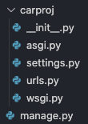
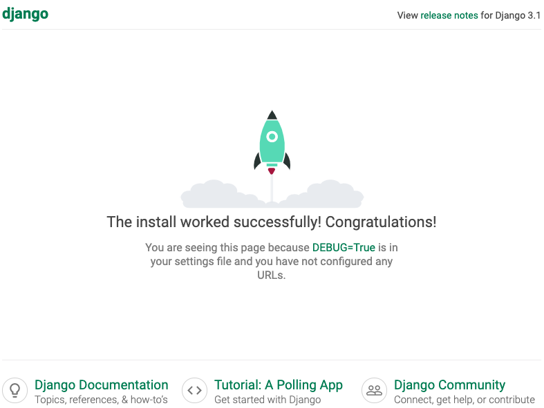
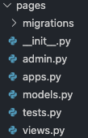
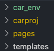
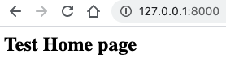
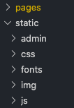

#### Project Setup

- if `venv` is not installed:

    - for Mac or Linux:

        - python3 -m pip install --user virtualenv  

    - for Windows:

        - py -m pip install --user virtualenv

1) Create <a href = "https://docs.python.org/3/library/venv.html"> virtual environment </a>

    ~~~ bash
    python3 -m venv car_env
    ~~~

    - if Python 3.7 needed

        ~~~ bash
        python3.7 -m venv ~/venv/py3.7
        ~~~

    - if using Windows

        ~~~ bash
        py -m venv car_env
        ~~~

2) Activate virtual environment

    - run `deactivate` within your `venv terminal` to exit the virtual environment 
    - the command line path should begin with `(car_env)`

        ~~~ bash
        source car_env/bin/activate
        ~~~

    - if venv created using Python 3.7

        ~~~ bash
        source ~/venv/py3.7/bin/activate
        ~~~

    - if using Windows

       ~~~ bash
       .\env\Scripts\activate
       ~~~

3) Install Django

    ~~~ bash
    pip install django
    ~~~

4) Create a project directory

    - Syntax `django-admin startproject name [directory]`
    - The `.` tells Django to install the project files in the current directory

       ~~~ bash
       django-admin startproject carproj .
       ~~~

    - the following directory structure is created

        

5) Launch default project
    - At this time, ignore any warnings regarding unapplied migrations
    - The default server runs at http://127.0.0.1:8000/
    - The default server does not serve static files but can be configured to do so
    - `CTRL + BREAK` quites server

        ~~~ bash
        python manage.py runserver
        ~~~

    - the default project should be running
        

6) After quitting server, install an app named `pages`

    - Syntax `django-admin startapp name [directory]`
    - `python manage.py` can be used instead of `django-admin`

        ~~~ bash
        python manage.py startapp pages
        ~~~

    - the following directory structure is created
        

7) Add the `pages` app to the project's `settings.py`

    - open pages/app.py and locate the class name

        ~~~ py
        class PagesConfig(AppConfig):
            name = 'pages'
        ~~~

    - add this to `settings.py`

        ~~~ py
        ...
        INSTALLED_APPS = [
        'pages.apps.PagesConfig',
        'django.contrib.admin',
        'django.contrib.auth',
        ~~~    

8) Update the project's `urls.py` to include `pages.urls`
    
    - add the `include` import
    - the `''` first argument points to the home page
    - the `namespace` pages allow precise reversing of `named URL patterns`

        ~~~ bash
        from django.contrib import admin
        from django.urls import path, include

        urlpatterns = [
            path('admin/', admin.site.urls),
            path('', include('pages.urls', namespace = 'pages'))
        ]
        ~~~        

9) Create `urls.py` in the app's `pages` folder to map URLs to views

    ~~~ py
    from django.urls import path
    from . import views

    urlpatterns = [
        path('', views.home, name = 'home'),
    ]
    ~~~

10) Create the `home` view in pages app `views.py`

    - A view is a callable which takes a request and returns a response
    - Django provides base view classes which will suit a wide range of applications. All views inherit from the View class, which handles linking the view into the URLs, HTTP method dispatching and other common features
    - the `home` view will render a `template`

        ~~~ py
        from django.shortcuts import render

        # Create your views here.
        def home(request):
            return render(request, 'pages/home.html')
        ~~~

11) Create the `home` template

    - Add `template\pages\pages.html` within the top-level project folder

        

        ~~~ html
        <h2> Test Home page </h2>
        ~~~

12) Add `templates` to the `DIRS` key in  `settings.py`

    ~~~ py
    ...
    TEMPLATES = [
        {
            'BACKEND': 'django.template.backends.django.DjangoTemplates',
            'DIRS': ['templates'],
            'APP_DIRS': True,
            ...
    ~~~

13) Test that template renders simple test page

    - restart the server `python manage.py runserver` & refresh the browser
    - the test page should now render

        

#### Building up project

1) Create landing page in `home.html`

2) Create static folder inside `carproj` and add static content
    - css, fonts, img, js

3) Register static files inside of `settings.py`, then run `collectstatic` 
    - add os import   `import os`
    - `os.path.join` joins path names into a single path
    - add to the end of the file

        ~~~ py
        ...
        STATIC_URL = '/static/'
        STATIC_ROOT = os.path.join(BASE_DIR, 'static')  # BASE_DIR / 'db.sqlite3'
        STATICFILES_DIRS = [
            os.path.join(BASE_DIR, 'carproj/static'),
        ]
        ~~~

    - `collectstatic` collects and organizes the static files into the absolute location of the collected files provided in STATIC_ROOT

        ~~~ bash
        python manage.py collectstatic
        ~~~

    - this creates a `static` folder inside the `carproj` folder
  
        

4) Modify `home.html` to use the static files

    - add  to the top of the file. This directs Django's template engine to use files from the `static` folder for the template
    - modify all `href` that include css, ico, or js files
    - also do the same for the `src`  in img tags with the alt tag `banner`

        - before

            ~~~ html
            <link rel="stylesheet" type="text/css" href="css/bootstrap.min.css">
            ...
            
            ...
            ~~~

        - after

            ~~~ html
            <link rel="stylesheet" type="text/css" href="">
            ...
            
            ...
            ~~~
